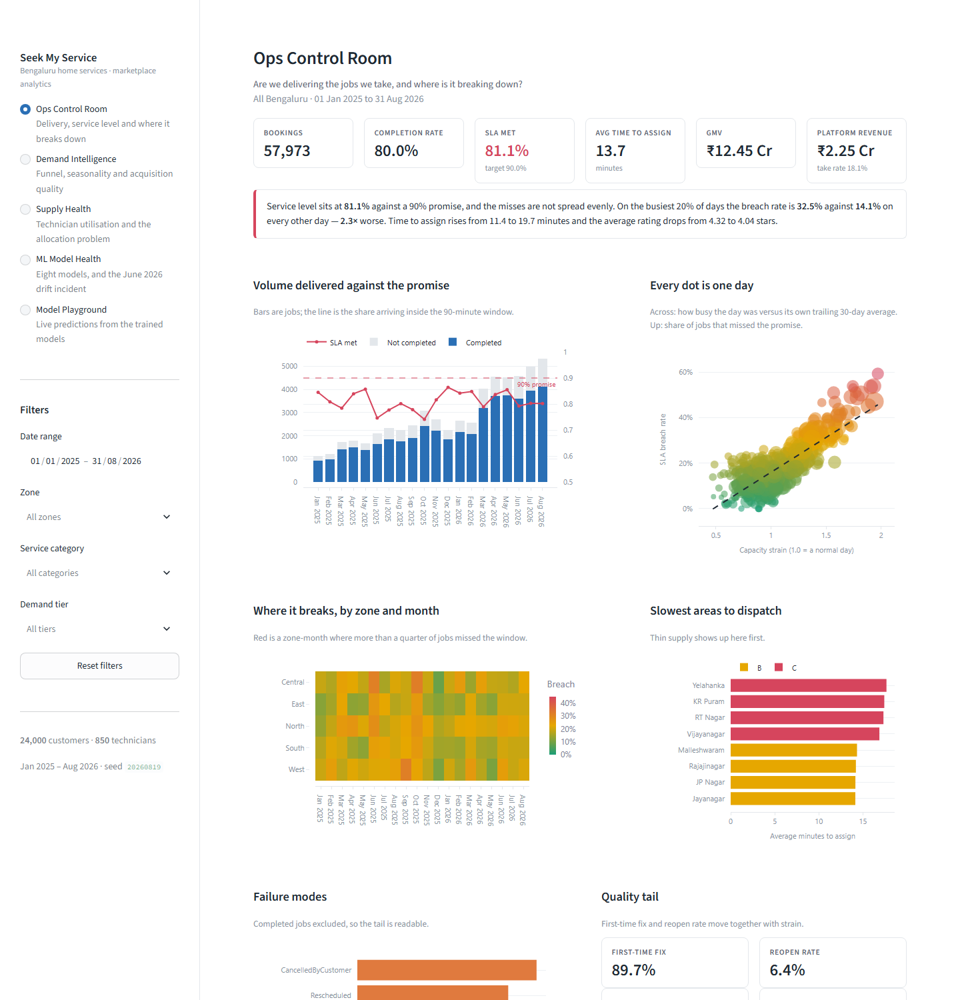
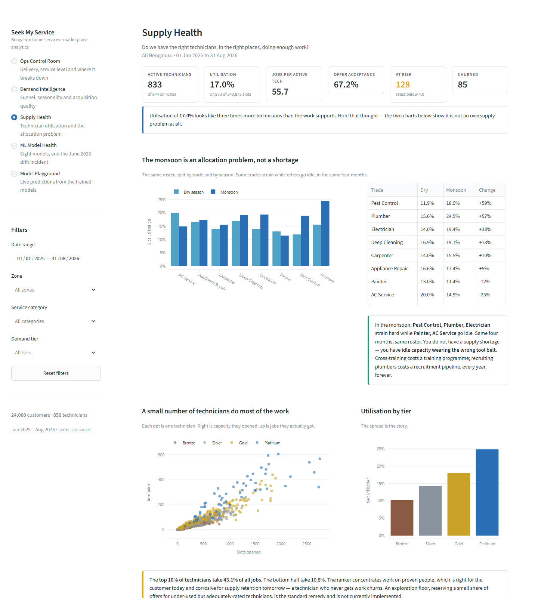
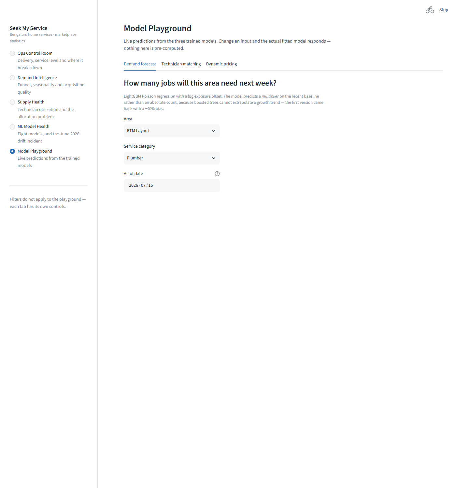
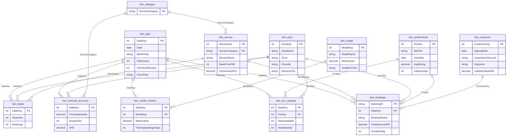
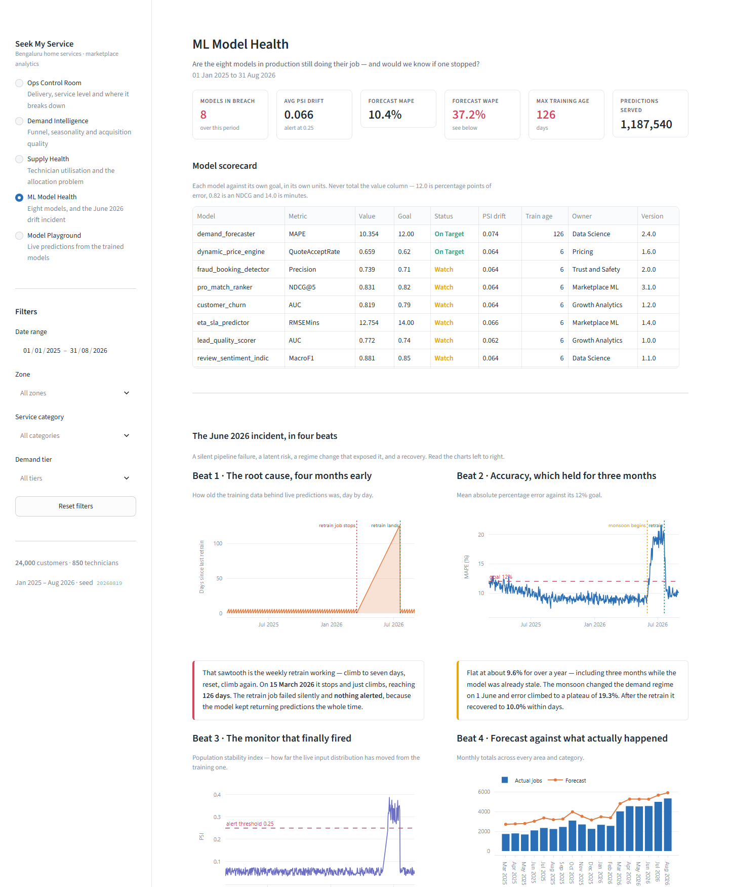

# Seek My Service

[](https://www.python.org/)
[](https://lightgbm.readthedocs.io/)
[](https://fastapi.tiangolo.com/)
[](https://streamlit.io/)
[](powerbi/measures.dax)
[](tests/)
[](validate.py)

**A production-shaped analytics and ML project for a Bengaluru home-services
marketplace.** Synthetic data, a Power BI star schema, a Streamlit dashboard,
three FastAPI model services, and a monitoring layer built around a real drift
incident.

```
57,973 bookings  ·  24,000 customers  ·  850 technicians  ·  8 ML models
20 months (Jan 2025 – Aug 2026)  ·  11 tables  ·  119 DAX measures
16 data integrity checks  ·  109 tests  ·  one fixed seed
```




---

> ## Why the data is synthetic
>
> **This is a sanitised recreation of client work.** The original engagement's
> data cannot leave the client's environment, so the whole pipeline was rebuilt
> against synthetic data with the same shape, the same seasonal behaviour and
> the same operational failure modes.
>
> "Seek My Service" is not a real company. Every booking, customer and
> technician in `data/` was generated by `generator/generate.py` from a fixed
> seed. **No real customer record was used, seen, or inferred** — which is the
> point. It makes the architecture, the modelling and the findings shareable
> without asking anyone to approve a data-sharing agreement first.
>
> What is *not* synthetic is everything structural: the schema design, the
> transformation layer, the 119 measures, the model choices, the monitoring
> approach, and the Bengaluru domain detail. See **"What is synthetic and what
> is realistic"** below for the full breakdown.

---

## Quickstart (Windows)

**Prerequisites:** Python **3.12** (not 3.13 or 3.14 — LightGBM wheels still
lag), and Power BI Desktop.

```bat
make all
make dashboard
```

`make all` runs setup, generate, validate, train and test in order — about four
minutes, most of it `pip install`. `make dashboard` then opens the Streamlit app
at **http://localhost:8501**.

Or step by step:

```bat
make setup       :: .venv on Python 3.12 + pinned dependencies
make generate    :: build the 11 CSVs in data\
make validate    :: 16 integrity checks, fails loudly
make train       :: train and persist all three models
make test        :: 109 tests
make dashboard   :: Streamlit dashboard on port 8501
make serve       :: three FastAPI services on ports 8001-8003
```

### The dashboard

Five pages at **http://localhost:8501**:

| Page | What it answers |
|---|---|
| **Ops Control Room** | Are we delivering the jobs we take, and where does it break? |
| **Demand Intelligence** | Where is demand unserved, and which channels are worth the money? |
| **Supply Health** | Do we have the right technicians, in the right places? |
| **ML Model Health** | Are the eight models still working — and would we know if one stopped? |
| **Model Playground** | Live predictions from the three trained models |

The Playground is the one a BI report cannot do: pick an area and a date and the
actual fitted model responds, with its held-out metrics shown underneath. The
same definitions drive this app and the Power BI model, so a number does not
change depending on which one you are looking at.

Pages are addressable, so you can link straight to one:
`?page=ML+Model+Health`.

| | |
|:--:|:--:|
|  |  |
| **Supply Health** — utilisation by trade and season | **Model Playground** — live predictions with held-out metrics |

Without `make`:

```bat
py -3.12 -m venv .venv
.venv\Scripts\python.exe -m pip install -r requirements.txt
.venv\Scripts\python.exe generator\generate.py
.venv\Scripts\python.exe validate.py
```

A `Makefile` with the same targets is provided for macOS, Linux and CI.

### Then the Power BI half

This part is manual — a `.pbix` is a binary package with an embedded
Analysis Services model, and there is no supported way to author one from a
command line. Budget 45–60 minutes.

1. Power BI Desktop → **Get data → Blank query → Advanced Editor**. Paste each
   query from `powerbi/queries.m`. Create the `DataFolder` parameter first and
   point it at your `data\` folder.
2. Wire relationships per `powerbi/RELATIONSHIPS.md`. **Mark `dim_date` as the
   date table** — skipping this breaks every time-intelligence measure.
3. Apply `powerbi/THEME.json` via **View → Themes → Browse for themes**.
4. **External Tools → Tabular Editor → Advanced Scripting**, paste
   `powerbi/measures_tabular_editor.csx`, press F5, then Ctrl+S. All 119
   measures land at once with folders and format strings.
   *No Tabular Editor? `powerbi/measures.dax` pastes into the DAX query view
   instead — see the header of that file.*
5. Build the four pages from `powerbi/BUILD_GUIDE.md`. Every visual has exact
   fields and pixel coordinates, and every KPI has its expected value so you can
   tell immediately if something is wired wrong.
6. Add the RLS roles from `powerbi/RLS.md` and test with **View as role**.

**Sanity check before building anything:** a Card with `[Total Bookings]` must
read **57,973**. If it does not, fix the model before adding pages.

---

## What is here

```
data/               11 generated CSVs, ~23 MB, committed on purpose
generator/          config.py (every constant) · seasonality.py · generate.py
powerbi/            queries.m · measures.dax · .csx · RELATIONSHIPS · BUILD_GUIDE · RLS · THEME
ml/                 3 FastAPI services · train_all.py · common/{io,features}.py
sql/                OLTP source schema · staging views · dimensional build
tests/              109 tests: seasonality, features, service contracts, app
docs/               CASE_STUDY · DEMO_SCRIPT · DATA_DICTIONARY
                    PRODUCTION_ARCHITECTURE · MODEL_CARDS · SOW_AND_PRICING
streamlit_app.py    Streamlit dashboard entry point
app/                5 dashboard pages, theme, cached data layer
validate.py         16 integrity checks
```

**Where to start:**

| You are | Read |
|---|---|
| A prospective client | `docs/CASE_STUDY.md` |
| Presenting this in 15 minutes | `docs/DEMO_SCRIPT.md` |
| Building the report | `powerbi/BUILD_GUIDE.md` |
| An engineer reviewing it | `generator/config.py`, then `validate.py` |
| Wondering if the models are honest | `docs/MODEL_CARDS.md` |

---

## The star schema



All relationships are **single-direction, dimension to fact**. No fact-to-fact
relationships. Two inactive relationships exist for `USERELATIONSHIP` —
`dim_professional[JoinDate]` and `dim_customer[SignupDate]` to `dim_date[Date]`.
`dim_category` is a one-column bridge, and `powerbi/RELATIONSHIPS.md` §4
explains why it has to exist.

---

## The drift incident



The ML Health page is built around a failure with four beats. Learn these four
dates and you can present the page without notes.

| Date | What happened | Where it shows |
|---|---|---|
| **15 Mar 2026** | The scheduled weekly retrain **silently stops succeeding**. Nothing breaks. The model keeps serving and accuracy stays at 9%, because nothing was watching freshness | `TrainingDataAgeDays` leaves its 7-day sawtooth and starts climbing |
| **1 Jun 2026** | The monsoon arrives. Plumbing demand nearly doubles, painting collapses. The model's fitted seasonal relationships are now three months stale | Demand charts on the Demand page |
| **15–18 Jun 2026** | PSI crosses the **0.25** alert threshold. MAPE degrades from 9% to a plateau of **19%**. Feature nulls rise to ~2.5%. This is the first visible signal | PSI chart, MAPE chart |
| **20 Jul 2026** | Retrain lands. Version **2.3.0 → 2.4.0**. `TrainingDataAgeDays` resets from **126 days** to zero. MAPE back to ~10% within four days | All three charts at once |

**The point:** *"It was broken in March and only looked broken in June.
The metric that would have caught it in March is how old the training data is —
one column, costs nothing, almost nobody monitors it."*

> **A note on how it is measured.** The **daily** MAPE plateau is 19.2%,
> exactly as designed. A **monthly** average reads ~16% for June and ~17% for
> July, because June contains the ramp-up and July contains the post-retrain
> recovery. That is arithmetic, not a discrepancy. Use the daily axis in the
> demo.

### The bonus finding

`[Forecast MAPE]` reads **10.4%**. `[Forecast WAPE]` reads **37.2%**. Both are
correct. The difference is **11,004 cells where the model forecast demand and
nothing arrived at all** — 14,806 phantom jobs against 55,654 real ones. MAPE
structurally cannot see them: a cell with zero actual jobs has no denominator,
so it is dropped from the average entirely.

Every one of those is, in principle, a technician sent to an empty street. A
monitoring page reporting only MAPE would have called this model healthy for
twenty months.

---

## What is synthetic and what is realistic

### Synthetic — I generated all of it

Every booking, customer, technician, lead, capacity row and model metric. All
57,973 bookings and every number derived from them. Technician names are
constructed from name pools. There is no real company, no real person, and no
real transaction anywhere in `data/`.

### Realistic — grounded in how Bengaluru actually works

- **20 real localities** with correct pincodes, correct zone assignments and
  approximately correct coordinates.
- **Both monsoons** — south-west (Jun–Sep) and north-east (Oct–Nov). Most
  datasets model only the first and lose the October plumbing surge.
- **Indian festival calendar** including Ugadi, Deepavali, Ganesh Chaturthi and
  Kannada Rajyotsava, with Karnataka public holidays.
- **Indian fiscal year**, April to March, formatted `FY26-27`.
- **INR price points** benchmarked to Bengaluru: tap install ₹450, AC service
  ₹650, 2BHK interior painting ₹26,000, modular kitchen ₹45,000.
- **UPI-dominant payments** at 56.7% — because that is what India looks like.
- **A name mix** reflecting Kannada, Tamil, Telugu, Hindi and Urdu-speaking
  backgrounds, with women concentrated in deep cleaning where they actually are.

### Modelled behaviour, not invented numbers

The relationships in the data are causal chains, not sampled correlations:

- Rain suppresses painting (×0.65) and drives plumbing (×1.9). Nobody paints in
  the rain.
- Heavy rain days raise cancellations, which lowers completion rate, which
  lowers GMV.
- Daily volume above the trailing 30-day mean raises time-to-assign, which
  raises SLA breaches, which lowers ratings.
- Referral customers repeat more, so their lifetime value is higher, so the
  acquisition-quality gap emerges rather than being asserted.
- The funnel and the capacity table are built **backwards from real bookings**,
  so reconciliation is exact by construction rather than approximate.

### What is deliberately unrealistic

Stated plainly, because a client will eventually ask:

- **The technician ranker scores too well** (NDCG@5 0.954). The generator assigns
  jobs using a known function of the same features the model sees, so it is
  recovering a process rather than learning a messy human one. Documented in
  `docs/MODEL_CARDS.md`.
- **Booking status depends on an unobservable rain draw**, which is why the
  pricing service's accept-probability classifier scores AUC 0.527 and is
  documented as not fit to ship.
- **No fraud, disputes, refunds or chargebacks** beyond a fraud *score* column.
- **No competitor pricing**, no marketing spend, no unit economics below GMV.
- Platform-wide utilisation of **17%** is low for a mature marketplace. It is a
  consequence of the brief's 850 technicians against 58,000 bookings, and it is
  reported as a finding rather than tuned away.

---

## Assumptions I made

Decisions taken without asking, recorded so they can be challenged.

| # | Assumption | Reasoning |
|---|---|---|
| 1 | `IsMonthEnd` flags the **last five days**, not the last calendar day | It marks the salary-cycle window that carries the ×0.85 demand effect. Flagging only the 31st would make that effect invisible |
| 2 | `Rescheduled` bookings carry **zero** money | The booking is superseded by a new record that carries the revenue. Counting both would double-count GMV |
| 3 | Diwali and Ugadi use **fixed windows** rather than lunar dates | The brief specified fixed windows. 2025's Deepavali (20 Oct) falls inside the configured Diwali window, so nothing is lost |
| 4 | `dim_customer[AreaKey]` and `dim_professional[HomeAreaKey]` are **not related** to `dim_area` | Both would create ambiguous filter paths. The fact tables already carry the operationally correct area |
| 5 | `dim_category` bridge added, beyond the eleven specified tables | `dim_service[ServiceCategory]` is not unique so it cannot filter `fact_forecast_accuracy`. Without the bridge, forecast-versus-actual by category is silently wrong |
| 6 | `APE` is a **fraction**; `MetricValue` is in each model's own units | Each is right for its consumer: `APE` feeds a `0.0%` format string, `MetricValue` is compared to `MetricGoal`. Called out in the data dictionary so nobody meets it in a visual |
| 7 | Add-ons only appear on discounted bookings | The specified ceiling is `Quoted + Discount`, so a zero-discount booking mathematically cannot exceed its quote. Discount frequency was raised to 55% so scope creep remains visible |
| 8 | Measures are hosted on `fact_bookings`, not a dedicated `_Measures` table | Avoids a manual "enter data" step. Display folders do the organising. Moving them later is a drag-and-drop |
| 9 | Status mix tuned to land total volume near 58,000 | Completed volume is pinned by the growth anchors, so `total = completed ÷ completion rate` made the completion rate the only free lever |
| 10 | `powerbi/build_measures.py` added as a source of truth | Hand-maintaining `measures.dax` and the `.csx` separately guarantees they drift apart. Both are generated from one list |
| 11 | Malleshwaram assigned to **Central** | Defensible for one of Bengaluru's central old localities, and it stops the Zone slicer having an empty member |
| 12 | Data folder defaults to this repo's path, not `C:\dev\seekmyservice` | The project was built here. It is one parameter edit in Power Query |

---

## Verification

Everything here was run, not assumed.

```bat
make validate    :: 16 of 16 checks pass, plus the CSV formatting guard
make test        :: 109 passed
make train       :: 3 of 3 artefacts written, held-out metrics printed
```

The checks earned their place during the build. Each of these was a real defect
found by an automated check rather than by someone noticing a strange number:

| Found by | Bug |
|---|---|
| `validate.py` | **Six technicians taking jobs after their churn date** — the same tenure calculation written twice, in slightly different ways. Now one shared helper |
| Service smoke tests | **Training-serving skew** — a feature added to the training frame but not to the single-row inference frame. Training passed; `/predict` raised |
| App smoke tests | **A silent join collision** — `MetricGoal` exists on both the fact and the dimension, so a merge renamed both and every downstream reference failed |
| Cross-checking app against `validate.py` | The strain threshold was taken across bookings in one place and across days in the other, giving 34.8% where validation said 32.5% for the same claim |

Held-out model metrics, measured on a forward-in-time split:

| Model | Metric | Value | Note |
|---|---|---:|---|
| demand_forecaster | MAPE, area × day | **13.7%** | the grain a planner acts on |
| | MAPE, cell grain | 47.7% | against a Poisson noise floor of **44.2%** |
| | Bias | −6.8% | was −39.6% before the log exposure offset |
| pro_match_ranker | NDCG@5 | **0.954** | optimistic — see model card |
| dynamic_price_engine | Price MAPE | **14.5%** | band coverage 78.2% vs 80% target |
| | Accept AUC | 0.527 | **not fit to ship** — see model card |

---

## Reproducibility

One seed (`config.SEED = 20260819`) drives everything. Regeneration is
byte-identical, so any number in the documentation can be traced back to the
code that produced it.

Every constant that shapes the data lives in `generator/config.py`. Nothing
seasonal is hard-coded in the generator — the windows are configuration and the
logic is in `generator/seasonality.py`, which is why
`tests/test_seasonality.py` can assert that painting in the Diwali/monsoon
overlap lands at exactly **1.56** (2.4 × 0.65) rather than trusting a comment.

---

## Licence and provenance

Built as a freelance portfolio piece. The synthetic data may be reused freely.
No real client data is present.
