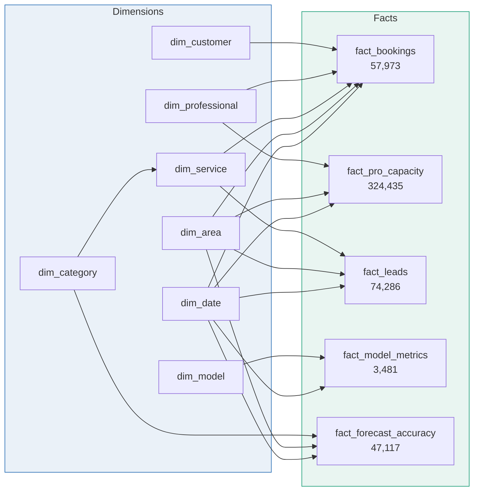

# Seek My Service — marketplace analytics & ML monitoring

[](https://www.python.org/)
[](https://lightgbm.readthedocs.io/)
[](https://fastapi.tiangolo.com/)
[](https://streamlit.io/)
[](powerbi/measures.dax)
[](tests/)
[](validate.py)

**An end-to-end analytics and ML platform for a Bengaluru home-services
marketplace** — dimensional model, semantic layer, three production model
services, and monitoring that catches a silent failure four months before it
becomes visible in any accuracy metric.


**Jump to:** [Findings](#what-the-data-revealed) · [The ML incident](#the-ml-incident-a-failure-with-four-beats) ·
[Architecture](#architecture) · [Run it](#run-it) · [Engineering notes](#engineering-notes) ·
[Case study](docs/CASE_STUDY.md) · [Demo script](docs/DEMO_SCRIPT.md) · [Model cards](docs/MODEL_CARDS.md)

---

## The problem

A home-services marketplace connects customers with carpenters, painters,
plumbers, electricians, AC technicians, cleaners, pest-control operators and
appliance-repair technicians across Bengaluru. It grew roughly **4.5× in twenty
months** — from about 900 completed jobs a month to about 4,100.

Growth of that shape creates a familiar set of problems:

- **Operations runs on yesterday's numbers.** Founders know service level is
  slipping. They cannot say which days, which areas, or why.
- **Marketing optimises for volume.** Cost *per acquisition* is measured. Value
  *per acquisition* is not.
- **Supply is recruited, not managed.** The roster grows because recruiting is a
  target, without anyone asking whether the technicians already signed up are
  getting work.
- **Eight ML models are in production and nobody is watching them.** They return
  predictions, so they look fine. A model that quietly stopped being retrained
  returns predictions too.

There was no analytics layer. Reporting meant exporting a CSV from the
production database — slow, risky, and different every time.

---

## What I built

| Layer | What it is |
|---|---|
| **Source model** | A normalised OLTP schema in PostgreSQL — the transactional database this data plausibly comes from, including an append-only booking event log and a prediction store |
| **Transformation** | Staging layer plus a dbt-shaped dimensional build. 11 tables, star schema, conformed dimensions |
| **Semantic model** | **119 DAX measures** across 8 display folders, every one with an explicit format string, deployed in a single click by a Tabular Editor script |
| **Power BI report** | Four pages — Ops Control Room, Demand Intelligence, Supply Health, ML Model Health — specified down to pixel coordinates and expected KPI values |
| **Streamlit app** | The same four pages plus a **live model playground**, sharing one set of definitions with the Power BI model |
| **ML services** | Three FastAPI services — demand forecasting, technician matching, dynamic pricing — with real feature engineering, held-out metrics and OpenAPI docs |
| **Monitoring** | Daily telemetry for eight models: metric vs goal, PSI drift, prediction volume, p95 latency, feature null rate, and training-data age |
| **Governance** | Row-level security by zone, data dictionary, model cards, and a production architecture with a costed migration path |

Everything is reproducible from one fixed seed. `make all` rebuilds the dataset,
revalidates it against 16 integrity checks, retrains all three models and runs
109 tests.

```
57,973 bookings  ·  24,000 customers  ·  850 technicians  ·  8 ML models
20 months (Jan 2025 – Aug 2026)  ·  11 tables  ·  119 DAX measures
₹12.45 Cr GMV  ·  ₹2.25 Cr platform revenue  ·  18.1% blended take rate
```

---

## What the data revealed

### 1. The monsoon is an allocation problem, not a supply shortage

Bengaluru has two monsoons. Demand does not simply rise in them — it **moves**.

| Trade | Dry season | Monsoon | Change |
|---|---:|---:|---:|
| Pest Control | 11.9% | 18.9% | **+59%** |
| Plumber | 15.6% | 24.5% | **+57%** |
| Electrician | 14.0% | 19.4% | **+38%** |
| Painter | 13.0% | 11.4% | **−12%** |
| AC Service | 20.0% | 14.9% | **−25%** |

*(technician slot utilisation)*

Plumbing volume goes from 471 jobs in May 2026 to 1,026 in August. Painting
falls from 209 to 142 over the same months, because nobody paints a Bengaluru
exterior in July.

The instinct during monsoon is to recruit more plumbers. The data says something
cheaper: **the company already has idle capacity — it is just wearing the wrong
tool belt.** Painters and AC technicians sit at 11–15% utilisation for four
months a year while plumbers strain.

Cross-training part of the painting roster costs a training programme.
Recruiting plumbers costs a recruitment pipeline, every year, forever.

### 2. The channel bringing the most customers brings the least value

| Channel | Customers | Repeat rate | Avg lifetime value |
|---|---:|---:|---:|
| Referral | 3,436 | **79.0%** | **₹7,793** |
| Organic Search | 4,862 | 72.2% | ₹6,628 |
| App Store | 2,339 | 64.3% | ₹5,354 |
| WhatsApp Broadcast | 1,988 | 54.3% | ₹4,344 |
| Google Ads | 4,416 | 50.4% | ₹4,158 |
| JustDial | 2,844 | 47.9% | ₹4,071 |
| Meta Ads | 4,115 | **39.9%** | **₹3,506** |

A referred customer is worth **2.2× a Meta Ads customer** and rebooks twice as
often — and Meta Ads is the second-largest source of new customers.

On cost per first booking, paid social probably looks like the best channel on
the marketing dashboard. On cost per rupee of lifetime value, it is the worst.

### 3. Service-level failure is a capacity problem, and it is predictable

Overall service level is **81.1%** against a 90% arrival promise. That average
hides the mechanism completely.

Split every completed job by whether its day ran hot — daily volume against the
trailing 30-day average:

| | Jobs | SLA breach | Time to assign | Avg rating |
|---|---:|---:|---:|---:|
| Busiest 20% of days | 12,120 | **32.5%** | 19.7 min | 4.04 |
| Every other day | 34,274 | **14.1%** | 11.4 min | 4.32 |

Breach rate **more than doubles**. Time to assign rises 73%. Rating drops 0.28
stars, which flows into the reviews the next customer reads.

This will not be fixed by performance-managing technicians. It is a dispatch
capacity problem on days that are **knowable in advance** — weekends, festival
windows, and the first heavy rain after a dry spell.

### Two things I did not expect

**Painting is 5% of jobs and 38% of GMV.** 3,029 of 57,973 bookings, and ₹4.7
crore of ₹12.45 crore. It also carries the *lowest* commission in the catalogue
at 15%, so the category driving a third of platform revenue is the one being
optimised least — and the monsoon painting dip is the largest seasonal revenue
exposure the business has.

**The Diwali window does +40% bookings and +150% GMV.** ₹85.1 lakh against ₹34.0
lakh in the preceding 25 days. It is the single biggest revenue window of the
year and, on this data, it is staffed like an ordinary October.

---

## The ML incident: a failure with four beats

The monitoring page is built around a real failure sequence, because a dashboard
that only ever shows green teaches people to stop looking at it.


| When | What happened |
|---|---|
| **15 Mar 2026** | The scheduled weekly retrain **silently stops succeeding**. Nothing breaks — the model keeps serving, accuracy holds at 9%, and no alert fires, because nothing was watching training-data freshness |
| **1 Jun 2026** | The monsoon arrives. Plumbing demand nearly doubles, painting collapses. The model's fitted seasonal relationships are now three months stale |
| **15–18 Jun 2026** | PSI crosses the **0.25** threshold. MAPE degrades from 9% to a plateau of **19.3%**. Feature nulls rise to ~2.5%. First visible signal |
| **20 Jul 2026** | Retrain lands. Version 2.3.0 → 2.4.0, training-data age resets from **126 days** to zero, MAPE back to ~10% within four days |

**The gap that matters is March to June.** The model was broken in March and only
*looked* broken in June — because degradation needs staleness **plus** a change
in the world, and between March and June the world did not change. The monsoon
was the trigger, not the cause.

> The metric that would have caught it on 29 March is **training-data age**. One
> column, already collected, on every model. Almost nobody monitors it.

### The finding MAPE structurally cannot see

`Forecast MAPE` reads **10.4%**, which looks like a healthy model.
`Forecast WAPE` reads **37.2%**. Both are correct.

The entire difference is **11,004 day-area-category cells where the model
forecast demand and nothing arrived at all** — roughly 14,800 phantom jobs
against 55,654 real ones. MAPE cannot see them: a cell with zero actual jobs has
no denominator, so it is dropped from the average entirely.

Every one of those is, in principle, a technician sent to an empty street. A
monitoring page reporting only MAPE would have called this model healthy for the
whole twenty months.

---

## Architecture

### Star schema

11 tables, all relationships single-direction dimension-to-fact. No fact-to-fact
relationships; `dim_date`, `dim_area` and `dim_service` are the conformed
bridges.



Full relationship table — including the two inactive relationships that need
`USERELATIONSHIP`, and the ones you should deliberately *not* create — is in
[`powerbi/RELATIONSHIPS.md`](powerbi/RELATIONSHIPS.md).

### Repository layout

```
generator/     config.py (every constant) · seasonality.py · generate.py
data/          11 generated CSVs, ~24 MB
validate.py    16 data integrity checks
sql/           OLTP source schema · staging views · dimensional build
powerbi/       queries.m · 119 measures · Tabular Editor script
               RELATIONSHIPS · BUILD_GUIDE · RLS · THEME
ml/            3 FastAPI services · train_all.py · common/{io,features}.py
app/           5 Streamlit pages, theme, cached data layer
tests/         109 tests
docs/          CASE_STUDY · DEMO_SCRIPT · DATA_DICTIONARY
               PRODUCTION_ARCHITECTURE · MODEL_CARDS · SOW_AND_PRICING
```

### How it becomes production

[`docs/PRODUCTION_ARCHITECTURE.md`](docs/PRODUCTION_ARCHITECTURE.md) covers the
migration against a real stack: read replica, dbt, orchestration (**and when
plain cron is honestly enough**), MLflow, FastAPI serving with predictions
written back to the warehouse, import-mode refresh scheduling, and where RLS
fits — with a five-phase path and a list of what I would deliberately *not*
build.

---

## Run it

**Prerequisites:** Python **3.12** (LightGBM wheels still lag on 3.13+).

```bat
make all
make dashboard
```

`make all` runs setup, generate, validate, train and test in order — about four
minutes, most of it `pip install`. `make dashboard` opens the Streamlit app at
**http://localhost:8501**.

| Target | What it does |
|---|---|
| `make generate` | Build the 11 CSVs |
| `make validate` | 16 integrity checks, fails loudly |
| `make train` | Train and persist all three models |
| `make dashboard` | Streamlit app on port 8501 |
| `make serve` | Three FastAPI services on ports 8001–8003 |
| `make test` | 109 tests |

### The dashboard

| | |
|:--:|:--:|
|  |  |
| **Supply Health** — utilisation by trade and season | **Model Playground** — live predictions with held-out metrics |

Pages are addressable by query parameter, so a single page can be linked
directly: `?page=ML+Model+Health`.

The **Model Playground** is the page a BI report cannot do. Pick an area and a
date, and the actual fitted model responds — with its held-out metrics shown
underneath, including the unflattering ones.

### The Power BI half

A `.pbix` is a binary package with an embedded Analysis Services model, so it is
assembled by hand — but every input is written down.
[`powerbi/BUILD_GUIDE.md`](powerbi/BUILD_GUIDE.md) gives the exact fields, pixel
coordinates on a 1280×720 canvas, conditional formatting rules, and the expected
value of every KPI so a mis-wired visual is obvious immediately.

---

## Engineering notes

### Honest model metrics

Reported as measured. Where a number is unflattering it is stated with the
reason, because a model card containing only good news is marketing.

| Model | Metric | Result | Reading |
|---|---|---:|---|
| **demand_forecaster** | MAPE, area × day | **13.7%** | the grain a planner acts on |
| | MAPE, cell grain | 47.7% | against a **Poisson noise floor of 44.2%** — the model sits 3.5 points above a bound no model can beat |
| | Bias | −6.8% | was −39.6% before adding a log exposure offset |
| **pro_match_ranker** | NDCG@5 | 0.954 | **optimistic** — the generator assigns jobs using a known function of the same features, so it recovers a process rather than learning a messy human one |
| **dynamic_price_engine** | Price MAPE | **14.5%** | band coverage 78.2% against an 80% target, zero quantile crossings |
| | Accept AUC | 0.527 | **not fit to ship** — adding load features moved it 0.530 → 0.527, i.e. not at all. The target is driven by an unobserved rain variable; the fix is a weather feed, not tuning |

The forecaster's exposure offset is the decision worth explaining: gradient
boosted trees **cannot extrapolate**. Trained to predict absolute volume against
a 4.5× growth trend, the first version came back with a −40% bias, because
validation volumes exceeded anything seen in training. Passing
`log(7 × recent daily mean)` as a Poisson offset turns the problem into "what
*multiple* of normal will next week be" — scale-free, and the question a supply
planner actually asks.

### Four real defects, each caught by an automated check

| Caught by | Defect |
|---|---|
| `validate.py` | **Six technicians taking jobs after their churn date** — the same tenure calculation written twice, slightly differently. Now one shared helper |
| Service smoke tests | **Training-serving skew** — a feature added to the training frame but not to the single-row inference frame. Training passed; `/predict` raised |
| App smoke tests | **A silent join collision** — `MetricGoal` exists on both fact and dimension, so pandas renamed both and every downstream reference failed |
| Cross-checking two surfaces | The strain threshold was taken across bookings in one place and across days in the other — 34.8% where validation said 32.5%, for the same claim |

### Data contract

PascalCase, ISO dates, UTF-8 without BOM, blanks as empty strings, and no
integer ever written with a decimal point — enforced by a formatting guard, not
by convention. `validate.py` checks referential integrity, date continuity,
money rules, chronology, funnel monotonicity and capacity reconciliation, and
fails the build if any break.

Three facts reconcile exactly — `Total Bookings`, `Funnel Bookings` and
`Slots Booked` all equal **57,973** — because the funnel and capacity tables are
built *backwards* from real bookings rather than sampled independently.

---

## Why the data is synthetic

**This is a sanitised recreation of client work.** Marketplace booking data does
not leave a client's environment, so the whole pipeline was rebuilt against
synthetic data with the same shape, the same seasonal behaviour and the same
operational failure modes.

"Seek My Service" is not a real company. Every booking, customer and technician
in `data/` was generated by `generator/generate.py` from a fixed seed. **No real
customer record was used, seen, or inferred.**

**What is synthetic:** the 57,973 bookings, 24,000 customers and 850 technicians,
and every figure derived from them.

**What is not:** the architecture and every engineering decision in it — plus the
20 Bengaluru localities with correct pincodes, zones and coordinates; both
monsoon seasons; the Indian festival calendar; the Indian fiscal year; INR price
points benchmarked to the city; and a payments mix that is 56.7% UPI, because
that is what India looks like.

The behaviour is modelled, not invented. Rain suppresses painting because nobody
paints in the rain. Heavy rain raises cancellations, which lowers completion
rate, which lowers GMV. Volume above the trailing mean raises time-to-assign,
which raises SLA breaches, which lowers ratings. These are causal chains, not
sampled correlations.

### Deliberately unrealistic, and said out loud

- **The ranker scores too well** (NDCG@5 0.954) — see the model card.
- **Booking status depends on an unobservable rain draw**, which is why the
  accept-probability classifier is documented as not fit to ship.
- **No fraud, disputes, refunds or chargebacks** beyond a fraud *score* column.
- **17% platform-wide utilisation** is low for a mature marketplace. It follows
  from 850 technicians against 58,000 bookings, and is reported as a finding
  rather than tuned away.

---

## Assumptions

Decisions taken without asking, recorded so they can be challenged.

| # | Assumption | Reasoning |
|---|---|---|
| 1 | `IsMonthEnd` flags the **last five days**, not the last calendar day | It marks the salary-cycle window carrying the ×0.85 demand effect. Flagging only the 31st would make that effect invisible |
| 2 | `Rescheduled` bookings carry **zero** money | The booking is superseded by a new record that carries the revenue. Counting both would double-count GMV |
| 3 | `dim_customer[AreaKey]` and `dim_professional[HomeAreaKey]` are **not related** to `dim_area` | Both create ambiguous filter paths. The facts already carry the operationally correct area |
| 4 | A `dim_category` bridge was added beyond the eleven core tables | `dim_service[ServiceCategory]` is not unique, so it cannot filter the forecast fact. Without the bridge, forecast-vs-actual by category is silently wrong |
| 5 | `APE` is a **fraction**; `MetricValue` is in each model's own units | Each is right for its consumer. Called out in the data dictionary so nobody meets it in a visual |
| 6 | Measures are hosted on `fact_bookings`, not a dedicated table | Avoids a manual "enter data" step; display folders do the organising |
| 7 | `powerbi/build_measures.py` generates both measure artefacts | Hand-maintaining `measures.dax` and the `.csx` separately guarantees they drift apart |
| 8 | Model artefacts are **committed** (2.3 MB) | They were ignored at first. On a 1 GB-memory free tier, a cold container training three models on first request is the most likely thing to fall over — for a visitor, not for me |

---

## Reproducibility

One seed (`config.SEED = 20260819`) drives everything. Regeneration is
byte-identical, so any number in this repository can be traced to the code that
produced it.

Every constant that shapes the data lives in
[`generator/config.py`](generator/config.py). Nothing seasonal is hard-coded in
the generator — windows are configuration and the logic is in
[`generator/seasonality.py`](generator/seasonality.py), which is why
[`tests/test_seasonality.py`](tests/test_seasonality.py) can assert that
painting in the Diwali / north-east monsoon overlap lands at exactly **1.56**
(2.4 × 0.65) rather than trusting a comment.

---

## Licence

Built as a portfolio artefact. The synthetic data may be reused freely. No real
client data is present.
