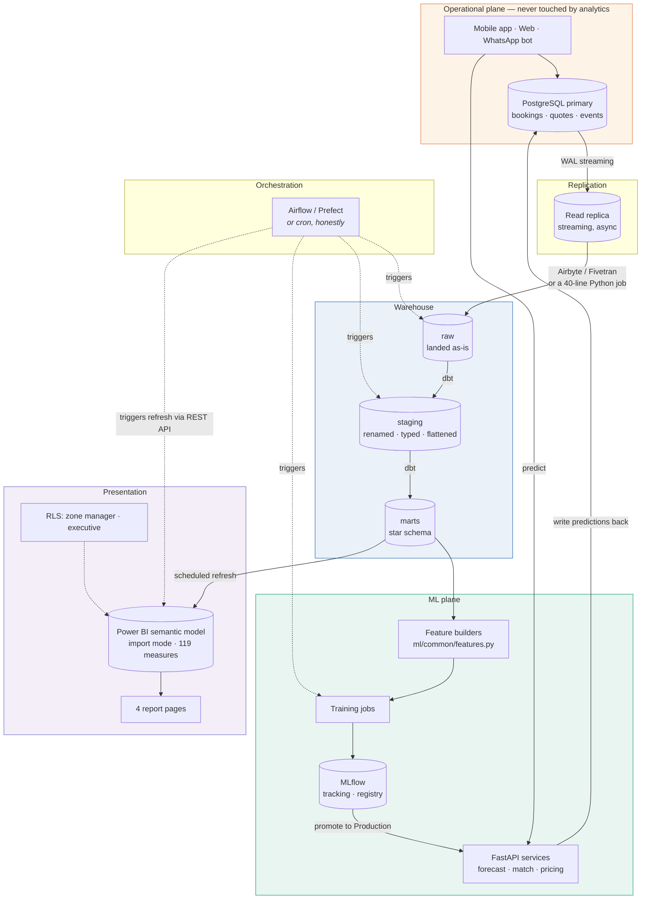

# Production architecture

How this becomes real against the client's actual stack, and in what order.

This is opinionated on purpose. Where there is a choice, I say which one I would
make and why — including the places where the boring answer is the right one.

---

## The one rule

> **Power BI must never query the transactional database directly.**

Not through DirectQuery, not through a "read-only" user, not "just for the
executive dashboard". Three reasons, in order of how badly each one bites:

1. **It will take production down.** A Power BI page with eight visuals fires
   eight concurrent queries on every slicer change. Ten viewers on a Monday
   morning is eighty queries against the database that is also trying to take
   bookings. The first outage will happen during a demo.
2. **The schema is the wrong shape.** Booking state lives in an event log;
   durations are differences between rows. Every visual would need window
   functions over that log, computed live, per interaction.
3. **The definitions would live in the report.** "Active customer" would be
   defined in DAX in one report and differently in DAX in another, and nobody
   would notice for a year.

The read replica is the boundary. Everything downstream of it is analytics and
can be slow, wrong, or restarted without anyone losing a booking.

---

## Target architecture



**The arrow worth staring at** is `API → PG`: predictions written back to the
database. Without it, the ML Health page cannot exist. You cannot report on a
model whose outputs were never persisted, and "we'll add logging later" means
the first six months of production behaviour are gone forever.

---

## Component decisions

### 1. Read replica, or a warehouse?

**Start with a read replica. Add a warehouse when it hurts.**

A streaming replica of the Postgres primary costs one instance and about an
hour of DBA time. At this data volume — 58,000 bookings over twenty months,
roughly 3,000 a month and growing — the replica *is* the warehouse. dbt can
build the star schema in the replica in its own schema.

Move to a real warehouse when one of these becomes true:

- fact tables pass ~50 million rows, or transformations run over ten minutes;
- you need to join data the OLTP database has never held — ad spend, weather,
  call logs;
- more than about three people are writing SQL and you need separate compute.

At that point: **BigQuery** if the client is on GCP or wants zero
infrastructure; **Snowflake** if they want the most mature tooling and can
handle the cost model; **Postgres with columnar extensions** if the budget is
genuinely tight and the data stays under a few hundred million rows.

What I would *not* do is start with Snowflake. A marketplace at this scale
buying a warehouse before it has a working replica is buying a bill it does not
need for a problem it does not have yet.

### 2. dbt for transformations

Yes, and without much argument. `sql/02_staging_views.sql` and
`sql/03_star_schema.sql` are already written in dbt's shape — staging models
that rename and type, mart models that hold business definitions — so the port
is mechanical.

What dbt buys that hand-written SQL does not:

- **Lineage.** `dim_customer` depends on `fact_bookings`, so dbt builds them in
  that order without anyone maintaining a run script.
- **Tests as part of the build.** The sixteen checks in `validate.py` become
  `schema.yml` tests plus a handful of singular tests. A failing test stops the
  pipeline instead of surfacing as a strange number in a meeting.
- **Documentation that cannot drift**, because it is generated from the models.

Structure:

```
models/
  staging/     stg_bookings.sql, stg_customers.sql, ...    materialized: view
  marts/       dim_*.sql, fact_*.sql                        materialized: table
                                                            (incremental on the
                                                             two big facts)
  schema.yml   not_null, unique, relationships, accepted_values
tests/         funnel monotonicity, capacity reconciliation,
               signup-precedes-first-booking
```

Make `fact_bookings` and `fact_pro_capacity` **incremental** on their date
column. Full rebuilds are fine now and will not be at ten times the volume.

### 3. Orchestration — and when cron is honestly enough

**Be honest about this one.** For the first six months, this pipeline is:
extract, run dbt, refresh Power BI, retrain three models weekly. That is four
steps in a fixed order once a day.

**Cron does that.** A shell script, `set -e`, and an alert on non-zero exit is
about forty lines and takes an afternoon. Airflow is roughly a week to stand up
properly, plus a database, plus a scheduler to keep alive, plus somebody who
knows what a DAG serialisation error means at 6am.

Recommending Airflow on day one would be recommending my own convenience.

**Move to Prefect or Airflow when** you have genuine branching (retrain only if
drift detected), real backfills, more than about a dozen tasks, or several
people needing to see run history without SSH access.

If you do move: **Prefect** for a small team — Python-native, less
infrastructure, gentler. **Airflow** if the client already runs it or has
enterprise scheduling requirements. **Dagster** if data assets and lineage are
the primary concern; it is the best fit conceptually and the least likely to be
already installed.

### 4. MLflow for tracking and registry

Yes, from the start. This one is cheap and pays immediately.

MLflow gives three things this project needs on day one:

1. **Every training run logged** — parameters, metrics, the exact data window.
   When someone asks in November why June's forecasts were poor, the answer is a
   query, not an archaeology project.
2. **A model registry with stages.** `Staging` → `Production` → `Archived`. The
   FastAPI services load `models:/demand_forecaster/Production` rather than a
   file path, so promoting a model is a registry transition, not a deploy.
3. **`training_data_max_date` logged as a tag on every version.** This is the
   column that would have caught the June 2026 incident four months early. It
   costs one line at training time.

Run it as the MLflow server backed by Postgres with artefacts in S3 or Azure
Blob. Do not run it with the local filesystem backend and then wonder where the
runs went when the container restarted.

### 5. Serving: FastAPI, with predictions written back

The three services in `ml/` are production-shaped already: Pydantic request and
response models, `/health` that reports genuine readiness rather than just
liveness, `/predict`, and OpenAPI docs.

What to add before production:

| Addition | Why |
|---|---|
| Load from the MLflow registry, not a joblib path | Promotion becomes a registry action |
| **Write every prediction back to `ml_predictions`** | Without this there is no ML Health page and no way to evaluate anything after the fact |
| Structured JSON logging with a request id | Correlate a bad prediction with a bad booking |
| Prometheus metrics on latency and volume | `/health` is a check, not a time series |
| Container, 2 replicas behind a load balancer | These are stateless; horizontal scaling is free |
| Feature-store or cached feature lookup | Currently each service rebuilds features from CSVs at startup — fine for a demo, not for p99 latency |

**Batch, not real-time, where it is allowed.** `demand_forecaster` runs nightly
for every area-category cell and writes results to a table. Nothing needs a
seven-day-ahead forecast synchronously. `pro_match_ranker` and
`dynamic_price_engine` genuinely are request-time — a customer is waiting.
Knowing which is which saves most of the infrastructure cost.

### 6. Power BI: import mode, scheduled refresh

**Import mode.** Not DirectQuery, and not composite.

The whole model is around 23 MB of CSV and compresses to well under Power BI
Pro's 1 GB dataset limit. Import mode gives sub-second visual interaction with
the VertiPaq engine doing the work, and it removes any possibility of a report
page reaching the operational database.

DirectQuery becomes worth reconsidering only if the client needs sub-hour
freshness, and they should be asked hard whether they truly do. "Real-time
dashboards" is usually a wish rather than a requirement, and the honest question
is: *what decision would you make differently at 10:05 that you would not make
at 11:00?* For a home-services marketplace the answer is almost always
dispatch — which is an operational screen, not a BI report.

**Refresh schedule.**

| Time (IST) | Job |
|---|---|
| 02:00 | Extract from replica into raw |
| 02:15 | `dbt build` — models plus tests |
| 03:00 | Power BI refresh, triggered by the REST API **after** dbt tests pass |
| 04:00 (Sun) | Weekly model retrain, log to MLflow |

Pro allows eight refreshes a day; this needs one. Trigger it from the pipeline
rather than on Power BI's own schedule, so a failed dbt run cannot publish a
half-built model to the business — a dashboard that is stale is a nuisance, a
dashboard that is confidently wrong is a liability.

Set the **refresh failure notification** to a shared mailbox, not to one
person's address. That person will eventually leave.

### 7. Row-level security

RLS lives on the **semantic model**, not the report, so it protects every report
built on that model including ones the client builds later.

Implement dynamic RLS with `USERPRINCIPALNAME()` against a `sec_user_zone`
mapping table in the warehouse — full pattern in `powerbi/RLS.md` §3. Membership
changes then become a warehouse `UPDATE` rather than a Desktop edit and
republish.

Two things that will otherwise cause a support ticket:

- **Workspace Admins, Members and Contributors bypass RLS entirely.** Test with
  a real Viewer account or "Test as role" in the Service.
- Filtering `dim_area` alone is **not sufficient**. `dim_customer` and
  `dim_professional` have no active relationship to it by design, so they need
  their own `LOOKUPVALUE` filters or a zone manager sees the entire 850-person
  roster with names.

---

## Modelling opinions

### Gradient boosting beats deep learning on these problems

Seven of the eight models are tabular: modest row counts, heterogeneous
features, strong feature interactions, plenty of missing values.

Gradient-boosted trees are the right answer and it is not close.

| | GBDT | Neural network |
|---|---|---|
| Tabular accuracy at this scale | Better, consistently | Competitive only with heavy tuning |
| Training time | Seconds to minutes on a laptop | Minutes to hours, GPU wanted |
| Missing values | Handled natively | Requires imputation, which is another decision to get wrong |
| Explaining a prediction | Feature importances and SHAP, arguable by a non-specialist | Genuinely difficult |
| Hyperparameter sensitivity | Forgiving | Unforgiving |

The academic literature has gone back and forth on this and the practical
picture has not: on tabular data of this shape, boosted trees win, and they win
while being cheaper to run and easier to defend in a meeting. Anyone proposing a
neural network for next-week demand forecasting on 58,000 rows should be asked
what specifically they expect it to do better.

**The exception, and it is a real one:** the demand forecaster's tree-based
nature is precisely why it needed the log exposure offset. Trees cannot
extrapolate a trend. That is a genuine limitation and the fix is a modelling
technique, not a different model family.

### Kanglish review sentiment needs MuRIL or IndicBERT

This is the one place a transformer earns its keep, and a generic English model
falls over completely.

A real Bengaluru review looks like:

> *"work ok tha but bahut late aaya, 2 ghante wait kiya"*

Hindi and English interleaved, Latin script, no consistent transliteration.
Kannada reviews arrive in both Kannada script and Latin transliteration, often
in the same sentence.

An English sentiment model reads "work ok" and returns mildly positive. The
customer waited two hours and is furious.

**Use MuRIL** (Google, 17 Indian languages, pre-trained on both native script
and transliterated text) or **IndicBERT** (AI4Bharat, lighter, similar coverage).
Both are trained on exactly this code-mixing. Fine-tune on a few thousand
labelled in-house reviews; you do not need tens of thousands.

Practical notes:

- Label a stratified sample **by language**, not at random, or Kannada will be
  under-represented and you will never know the model is weak on it.
- Report **per-language F1**, not just macro-F1. Macro-F1 will happily hide a
  Kannada class performing at 0.6.
- Serve on CPU with ONNX Runtime. At this review volume a GPU is not justified,
  and 340 ms p95 is fine for an asynchronous job.
- This model is quarterly-retrain, not weekly. Language drifts slowly. Slang
  does not, but not weekly.

### Where I would not use ML at all

Two of the highest-value findings in the case study need no model:

- The **acquisition channel quality gap** is a `GROUP BY`.
- The **capacity-strain to SLA link** is a scatter plot.

Both would change a decision this quarter. Neither needs a model, and proposing
one would be a way of making simple work look expensive.

---

## Migration path

**Phase 1 — Foundations (weeks 1–3).** Read replica. Extraction into raw. dbt
project with staging and marts. The sixteen validation checks as dbt tests. A
cron script and an alert on failure. *Deliverable: a warehouse the star schema
builds in, tested nightly.*

**Phase 2 — Semantic layer and report (weeks 3–5).** Power BI import model
against the marts. 119 measures via the Tabular Editor script. Four report
pages. RLS roles. Scheduled refresh triggered by the pipeline.
*Deliverable: the report, in the Service, refreshing itself.*

**Phase 3 — ML platform (weeks 5–8).** MLflow tracking and registry. The three
services containerised and loading from the registry. **Predictions written back
to the database.** The ML Health page then has real data behind it instead of
simulated telemetry. *Deliverable: models with lineage, and monitoring that
reflects reality.*

**Phase 4 — The alert that matters (week 8, one day).** `TrainingDataAgeDays`
monitored on every model with a threshold of 14 days.

> Do this **first** if you do nothing else on this list. It is one column,
> already collected, and it is the difference between finding out in March and
> finding out in June.

**Phase 5 — Weather (week 9+).** Ingest a Bengaluru forecast feed. It is the
highest-value feature addition available: it plausibly improves the demand
forecaster, the ETA predictor, and the accept-probability classifier that
currently does not work at all.

---

## What I would deliberately not build

- **A real-time streaming pipeline.** Nothing here needs sub-minute latency.
  Kafka would be resume-driven development at this scale.
- **A feature store**, until there are more than about five models sharing
  features. `ml/common/features.py` is the feature store until it hurts.
- **A custom Power BI visual.** Everything in the build guide uses what ships in
  the box. Custom visuals are a support burden and an AppSource dependency for
  marginal aesthetic gain.
- **Fabric capacity**, unless the client specifically wants Copilot and has
  costed F2 or higher. Nothing in this project needs it, and the licensing note
  in `SOW_AND_PRICING.md` explains what it would actually cost.
- **A/B testing infrastructure**, until there is a second model to test against.
  Ship one, monitor it, then earn the right to test.
